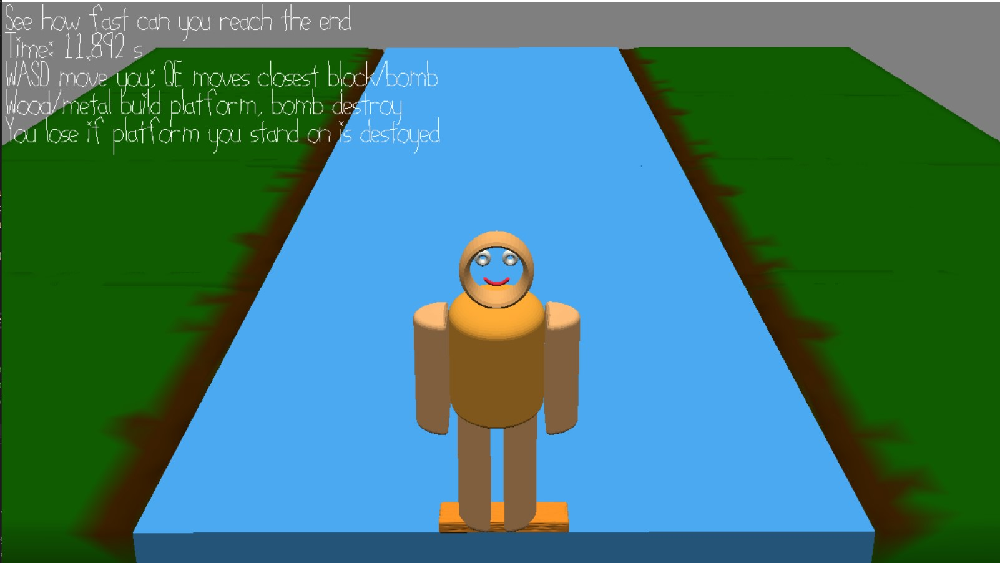

# Tetris River

Author: Shao-Ju Wang

Design: Collect wood to build platform, build wisely to mitigate bomb impact

Screen Shot:

How To Play:

See how fast can you reach the end
Wood/metal build platform, bomb destroy it
You lose if platform you stand on is destoyed
WASD moves you; QE moves closest block/bomb

This game was built with [NEST](NEST.md).
